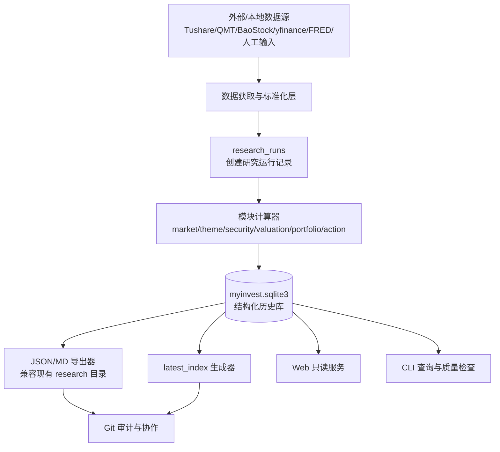

# MyInvest 数据库优先重构设计文档

版本：v0.1
生成日期：2026-06-11
适用项目：MyInvest20260601 / MyInvest A 股研究与风控辅助系统
目标读者：Codex、项目维护者、后续 Web/B/S 开发者
状态：设计草案，可直接作为后续任务拆分依据

---

## 0. 结论先行

当前系统已经形成了很完整的“文件化研究工作流”：市场仓位、主题研究、ETF/个股档案、估值报告、组合快照、目标仓位、操作建议、盘前检查、盘中提醒、盘后复盘、决策日志都以 `research/**/*.json` 和 `research/**/*.md` 形式落盘，并通过 `research/latest_index.json` 读取最新版本。

但如果目标变成：

- 随时查看某个个股/ETF 的历史估值变化；
- 对比每次估值报告里的低估区、合理区、偏贵区、泡沫/拥挤区如何移动；
- 回溯每次市场研究、主题研究、操作建议、仓位分配、仓位编号的历史；
- Web 页面可直接按代码、日期、模块、仓位桶、动作类型查询；
- 后续让 Codex 在开发时依赖结构化状态，而不是到处扫描文本文件；

那么系统应该升级为 **数据库优先（DB-first）架构**。

本设计不建议“一刀切重写”。推荐采用三阶段演进：

1. **Phase 1：并行落库**
   保留现有 JSON/MD 产物；新增独立的 SQLite 历史事实库、迁移脚本、历史导入器、查询 CLI。先把估值历史导入数据库，实现估值历史查询闭环；组合、仓位编号、操作建议随后分批接入。

2. **Phase 2：生成器双写**
   核心生成脚本继续输出 JSON/MD，同时可选写入历史事实库。`project_check.py` 增加 DB 完整性检查。现有 Web 当前态库仍服务 current-only 页面，历史页面从历史事实库读取。

3. **Phase 3：数据库主存储**
   新研究从 `research_runs` 开始建模，结构化结果先入库，再从数据库导出 JSON/MD 作为审计快照和 Git 协作副本。`latest_index.json` 由数据库生成，不再作为事实源。

> 核心原则：**Markdown 是人看的报告，JSON 是兼容层和审计快照，数据库才是历史事实和 Web 查询的主存储。**

---

## 1. 当前系统能力与问题定位

### 1.1 当前已有模块

根据当前开发包，项目已经包含以下能力：

| 模块 | 当前产物路径 | 当前职责 |
|---|---|---|
| 市场仓位 | `research/market/market_score_*.json/md` | 决定权益/现金仓位区间、市场状态、拥挤惩罚 |
| 主题研究 | `research/themes/theme_review_*.json/md`、`theme_registry.json` | 评估 A/B/C/D 主题、阶段、升级/降级 |
| ETF 研究 | `research/etfs/*.json/md`、`etf_registry.json` | ETF 角色、评级、目标仓位、操作条件 |
| 个股研究 | `research/stocks/*.json/md`、`stock_registry.json` | 个股逻辑、估值、风险、触发条件 |
| 估值研究 | `research/valuations/valuation_*.json/md` | 低估/合理/偏贵/拥挤区间、估值指标、趋势参考 |
| 组合快照 | `research/portfolio/portfolio_snapshot_*.json` | 比例级持仓、仓位桶、风险暴露 |
| 目标配置 | `research/allocation/target_allocation_*.json/md` | 目标权益、现金/短融、各桶目标比例 |
| 操作建议 | `research/actions/action_plan_*.json/md` | 按比例的 Reduce/Add/Hold/Watch/ResearchFirst 建议 |
| 盘前策略简报 | `research/briefings/strategy_briefing_*.json/md` | 重大新闻、策略精要、重点方向、风险提示 |
| 盘前执行检查 | `research/checks/premarket_check_*.json/md` | 执行门禁、禁止事项、盘中监控清单 |
| 盘中提醒 | `research/alerts/intraday_alert_*.json/md`、`intraday_rules.json` | QMT 只读触发检查、估值跨区提醒 |
| 盘后复盘 | `research/reviews/post_market_review_*.json/md` | 判断偏差、执行偏差、第二天观察点 |
| 决策日志 | `research/logs/decision_log.md` | 记录关键结论变化和复盘入口 |
| 质量检查 | `scripts/check_*.py`、`project_check.py` | ratio-only、ResearchFirst、跨文件一致性、估值更新检查 |
| 最新索引 | `research/latest_index.json` | 当前每类模块最新文件索引 |

### 1.2 当前架构的优点

当前文件化架构并不是错的，它已经解决了很多重要问题：

- 每份研究报告都有独立时间戳，不会覆盖旧报告。
- JSON/MD 双产物既能机器读取，也能人工审查。
- `latest_index.json` 能快速定位最新报告。
- `check_ratio_only.py`、`check_research_first_gate.py` 等脚本守住隐私和研究先行边界。
- 研究结果能通过 Git 协同、审查、回滚。

### 1.3 当前架构的根本短板

文件化系统对“最新版本工作流”很好，对“历史结构化查询”很差。核心问题如下。

#### 问题 A：历史存在，但不可查询

例如某只股票有多份估值报告：

```text
research/valuations/valuation_688333_SH_西安铂力特_2026-06-05_103909.json
research/valuations/valuation_688333_SH_西安铂力特_2026-06-09_153822.json
```

当前系统能保留文件，但没有统一表结构来回答：

- 每次 `reasonable_allocation` 的上下界是多少？
- `crowded_risk` 起点从多少变到多少？
- 当前价格相对合理区中位数偏离多少？
- 估值区间变化是价格变化导致，还是估值模型/样本变化导致？
- 某次 action_plan 是否引用了某次估值？

#### 问题 B：`latest_index.json` 是最新索引，不是历史数据库

`latest_index.json` 的目标是“找到最新版本”。它不会为每个 code 建立完整时间序列，也不会把 valuation zone、score component、bucket exposure 拆成可查询字段。

#### 问题 C：跨模块关系靠文件路径和人脑维护

操作建议依赖市场仓位、主题、组合、目标仓位、估值、盘中规则。当前依赖关系通常在 JSON 的 `source_files` 或 `dependencies` 里，但没有统一的关系表。因此很难查询：

- 某次操作建议依赖了哪些上游研究？
- 上游研究更新后，哪些 action_plan 自动失效？
- 某个标的最近一次 ResearchFirst 被阻断的原因是什么？
- 某个仓位桶长期偏离目标的次数和幅度是多少？

#### 问题 D：Web 如果只读文件，会永远是“附属展示层”

如果 Web 页面每次都扫描 `research/**/*.json`，再临时聚合历史，那么：

- 页面加载慢；
- 查询逻辑分散；
- 很难做复杂筛选和趋势图；
- 新字段必须改很多地方；
- Codex 后续开发容易变成“又写一个遍历文件脚本”。

要让 Web 真正成为系统入口，数据层必须先结构化。

---

## 2. 重构目标与非目标

### 2.1 总目标

建立一个数据库优先的研究历史系统，使每次市场研究、主题研究、标的研究、估值、组合快照、目标仓位、操作建议和复盘都进入统一数据库，并支持 Web/CLI 查询。

### 2.2 必须支持的核心问题

#### 2.2.1 个股/ETF 历史估值对比

用户应该可以查询：

```text
688333.SH 西安铂力特
2026-06-05：合理区 80-105，拥挤区 >150，当前 92，区间：合理
2026-06-09：合理区 74-112，拥挤区 >153，当前 87，区间：合理
变化：合理区中位数下移/上移 X%，当前价格相对合理区中位数偏离 Y%
```

Web 页面应支持：

- 估值区间带随时间变化图；
- 当前价格与各区间边界叠加图；
- 历史估值报告列表；
- 每次估值依据、数据源、样本天数、数据缺口；
- 与 action_plan、portfolio_snapshot 的引用关系。

#### 2.2.2 市场研究历史

用户应该可以查询：

- 市场仓位分数历史；
- 权益目标区间历史；
- 现金/短融目标区间历史；
- 指数趋势、市场广度、成交流动性、资金风险偏好等分项打分历史；
- 每次仓位收缩/放大的理由。

#### 2.2.3 主题研究历史

用户应该可以查询：

- 某主题战略评级、交易评级、阶段变化；
- 主题从 B 到 A 或从 A 到 B 的原因；
- 哪些 ETF/个股被该主题引用；
- 主题变化对 action_plan 的影响。

#### 2.2.4 标的研究历史

用户应该可以查询：

- 某个股/ETF 每次研究档案的评级变化；
- 分项评分变化；
- 买入/加仓/减仓/失效条件变化；
- 风险监控项变化；
- 是否已满足 ResearchFirst 门禁。

#### 2.2.5 仓位编号和仓位桶历史

用户应该可以查询：

- 每个持仓标的属于哪个稳定仓位编号；
- 该仓位编号历史上属于哪个 bucket；
- 每次 portfolio_snapshot 中该仓位权重是多少；
- 每次 target_allocation 给它所在 bucket 的目标是多少；
- 该仓位对偏离的贡献是多少；
- 某个 bucket 长期是否超配/低配。

#### 2.2.6 操作建议历史

用户应该可以查询：

- 每次 action_plan 的结论、动作、优先级、触发条件、失效条件；
- 操作建议对应哪个仓位编号、标的、bucket；
- 建议变化是因为市场仓位、估值、主题、组合偏离还是门禁变化；
- 盘后复盘是否证明该建议有效、无效或无法判断。

### 2.3 非目标

以下内容不属于本次数据库化重构目标：

- 不做自动交易。
- 不新增 QMT 下单、撤单、改单能力。
- 不在数据库或报告中保存账号、订单号、成交号、持仓数量、成交金额、账户资产、市值、成本金额等敏感字段。
- 不把估值区间直接转成买卖指令。
- 不绕过 ResearchFirst。
- 不因为引入数据库就删除现有 JSON/MD 审计报告。
- Phase 1 不强制引入 PostgreSQL、Docker 或云服务。

---

## 3. 目标架构

### 3.1 目标数据流



### 3.2 分层说明

| 层 | 职责 | Phase 1 | Phase 2 | Phase 3 |
|---|---|---:|---:|---:|
| 数据源层 | 拉取行情、财务、宏观、新闻、QMT 快照 | 保持现状 | 部分标准化 | 标准化入库 |
| 运行记录层 | 每次研究先创建 `research_run` | 新增 | 必须 | 必须 |
| 结构化结果层 | 把评分、估值区间、仓位、动作拆表 | 新增历史导入 | 双写 | 主写 |
| 原始快照层 | 保存原 JSON 的 raw payload 和 hash | 新增 | 必须 | 必须 |
| 导出层 | 从 DB 输出 JSON/MD | 可选 | 必须 | 必须 |
| 质量门禁 | 检查 DB 与文件一致性、隐私边界 | 新增 | 必须 | 必须 |
| Web 层 | 只读查询、图表、历史对比 | 暂不新建 Web；先保留现有 current-only Web | 历史页接入现有 `web/backend` | 项目入口 |

### 3.3 数据库位置与同步策略

推荐 Phase 1 使用 SQLite，并把历史事实库与现有 Web current-only cache 分开：

```text
temp/history_db/myinvest_history.sqlite3
```

现有 `.gitignore` 已忽略 `temp/` 和 `*.sqlite3`。如后续要支持非 temp 的本地库，可再补充：

```text
data/*.sqlite3
data/*.sqlite3-*
data/backups/
```

原因：

- SQLite 是二进制文件，不适合多人并发 Git 合并。
- 真实本地数据库未来可能包含更完整的持仓比例、研究输入和本地路径，应默认不提交。
- 现有 Web 库已经固定在 `temp/web_db/myinvest.sqlite`，它是 current-only cache；历史事实库必须使用另一个文件，避免 current-only 与 historical 语义混用。
- Git 继续保存 JSON/MD 导出结果，用于审计和跨设备重建。

如果用户希望多台电脑共享同一个数据库，有三种后续方案：

| 方案 | 优点 | 缺点 | 建议阶段 |
|---|---|---|---|
| 本地 SQLite + 从 Git 研究产物重建 | 简单、安全、兼容现状 | DB 不是唯一同步源 | Phase 1 |
| 加密 SQLite 备份到私有网盘/对象存储 | 保留完整 DB | 需要备份脚本和恢复流程 | Phase 2 |
| PostgreSQL / 私有云 DB | 真正多端共享 | 运维成本高，隐私边界更复杂 | Phase 3+ |

本设计建议：**Phase 1 不提交 SQLite 数据库本体，但必须提供 `db_rebuild_from_artifacts.py`，可以从仓库内 JSON 产物重建结构化历史库。** 这不是回到文本主存储，而是迁移期的安全兜底。Phase 3 后如果部署私有数据库，则数据库成为跨设备事实源。

### 3.4 与现有 Web current-only 数据库的关系

当前仓库已经有只读 Web 层和 current-only SQLite read model：

```text
temp/web_db/myinvest.sqlite
```

该数据库由 `research/latest_index.json` 的 `modules` 指针重建，只表达“当前有效状态”，不读取 `latest_index.files` 作为当前输入，也不是历史事实库。历史重构必须遵守以下边界：

1. `temp/web_db/myinvest.sqlite` 继续服务当前 Web、current-only API、审计包和 readiness 页面。
2. `temp/history_db/myinvest_history.sqlite3` 服务历史查询、估值区间漂移、仓位编号历史、操作建议历史和证据链回溯。
3. Phase 1/2 不用历史库替换 current-only Web 库，不改变 `scripts/ingest_current_state_to_web_db.py` 的职责。
4. Web 历史页面应接入现有 `web/backend`、router、service、template 结构；不要新增并行的 `web/app.py`。
5. 历史库中的 `artifacts.path`、依赖路径和导出路径必须使用仓库相对路径，禁止保存本地绝对路径。
6. `latest_index.json` 在 Phase 1/2 仍是当前态入口；历史库可以用于回溯，但不能反向改写 current-only 结果。

---

## 4. 核心设计原则

### 4.1 Append-only：研究结果默认追加，不覆盖

研究系统最重要的是“当时怎么判断”。因此数据库中核心事实表默认 append-only：

- 新市场研究生成新 `research_run`。
- 新估值生成新 `valuation_report`。
- 新操作建议生成新 `action_plan`。
- 固定配置文件如 `theme_registry.json`、`bucket_registry.json` 也要作为 `config_snapshots` 保存历史版本。

允许更新的字段仅限：

- `ingested_at`；
- 后补的 `artifact_id`；
- 后补的 `quality_check_result`；
- 明确标记为 `superseded_by_run_id` 的指针字段。

不得直接覆盖旧结论。

### 4.2 Raw + Normalized 双层存储

每个 JSON 报告入库时，必须同时保存：

1. **Safe Raw JSON**：经过隐私扫描和 ratio-only sanitizer 后的 JSON 文本、sha256、仓库相对路径、module、generated_at。用于审计、重建、兼容未知字段。
2. **Normalized tables**：把高频查询字段拆到结构化表，例如估值区间、市场分项评分、仓位桶权重、操作建议动作。

这样可以避免两个极端：

- 只存 safe raw JSON：查询仍然复杂。
- 只存结构化字段：未来模板变化会丢信息。

Raw 层不是“绕过隐私边界的原样归档”。入库前必须先判断 artifact 类型：

1. 估值、市场、主题等天然不含账户明细的研究报告，可以保存 sanitizer 通过后的完整 JSON。
2. 组合、操作建议、盘前/盘中/盘后、质量输出、命令输出等可能携带敏感字段的模块，只能保存 sanitizer 通过后的安全子集；原文件仍由 Git 中的 JSON/MD 审计快照承担追溯职责。
3. 发现账号、金额、数量、订单、成交、完整本地绝对路径、token 等字段时，导入器必须失败或跳过 raw，并写入 `privacy_scan_results`。
4. `artifacts.path`、`dependency_path`、`config_snapshots.path` 只能保存仓库相对路径。
5. `quality_checks.raw_output`、`research_runs.command`、`decision_events.raw_text` 等自由文本字段必须截断并经过同一隐私扫描。

### 4.3 研究结论与交易动作严格分离

数据库中必须保留语义边界：

- `valuation_report.security_stance` 是标的级估值状态，不是组合动作。
- `action_plan` 才是组合级动作建议，但也只能 ratio-only。
- `intraday_alert` 是触发提醒，不是自动交易。
- `portfolio_snapshot` 只保存比例级持仓，不保存数量和金额。

### 4.4 每个结论必须有来源链

任何操作建议都应能追溯到：

- 使用的市场仓位报告；
- 使用的主题研究；
- 使用的组合快照；
- 使用的目标仓位；
- 使用的估值报告；
- 使用的盘中规则；
- 当时质量门禁状态。

数据库通过 `artifact_dependencies` 和 `run_dependencies` 表保存这些关系。

### 4.5 Web 永远只读

Phase 1/2 Web 只允许：

- GET 查询；
- 图表展示；
- 下载报告；
- 查看依赖链和质量门禁。

禁止：

- 从 Web 创建交易指令；
- 从 Web 调 QMT 下单；
- 从 Web 修改研究结论；
- 暴露本地 token、账号、订单、持仓数量、金额。

---

## 5. 建议目录结构

新增目录建议如下：

```text
myinvest/
  db/
    __init__.py
    connection.py
    migrations.py
    schema.py
    normalize.py
    ingest.py
    extractors/
      __init__.py
      market_score.py
      theme_review.py
      security_profile.py
      valuation_report.py
      portfolio_snapshot.py
      target_allocation.py
      action_plan.py
      intraday.py
      review.py
    queries/
      valuation_history.py
      market_history.py
      position_history.py
      action_history.py
    privacy.py

scripts/
  db_migrate.py
  db_ingest_research_artifacts.py
  db_rebuild_from_artifacts.py
  db_query_valuation_history.py
  db_query_market_history.py
  db_query_position_history.py
  db_export_report.py

web/
  backend/
    app/
      routers/             # 后续接入历史只读 API
      services/            # 后续接入历史查询 service
      templates/           # 后续增加历史页面模板
      static/              # 复用现有静态资源

migrations/
  0001_core.sql
  0002_research_modules.sql
  0003_views.sql

temp/
  history_db/
    myinvest_history.sqlite3   # ignored
  web_db/
    myinvest.sqlite            # existing current-only cache, ignored

tests/
  test_db_migrate.py
  test_code_normalize.py
  test_ingest_valuation.py
  test_ingest_action_plan.py
  test_privacy_db.py
```

说明：

- `myinvest/db/` 放可复用代码；脚本只做 CLI 包装。
- `migrations/*.sql` 必须可重复检查，不能依赖手工执行。
- `temp/history_db/` 是历史事实库默认位置；数据库本体不提交。
- `temp/web_db/myinvest.sqlite` 是现有 current-only Web cache，不由历史导入器覆盖。
- `web/backend/` 是后续只读 B/S 页面接入点，不新增并行 Web 应用。

---

## 6. 数据模型总览

### 6.1 表分组

| 分组 | 表 | 说明 |
|---|---|---|
| 元数据 | `schema_migrations`、`app_settings` | 数据库版本、配置 |
| 运行与产物 | `research_runs`、`artifacts`、`artifact_dependencies`、`run_dependencies` | 所有研究运行和文件依赖 |
| 标的主数据 | `securities`、`security_aliases`、`buckets`、`bucket_assignment_history` | 股票/ETF/指数/现金工具和仓位桶 |
| 市场研究 | `market_score_runs`、`market_score_components`、`market_allocation_ranges`、`market_hard_constraints`、`market_trigger_adjustments` | 市场仓位历史 |
| 主题研究 | `themes`、`theme_review_runs`、`theme_review_items`、`theme_security_links` | 主题评级历史 |
| 标的档案 | `security_profile_runs`、`security_profile_scores`、`security_operation_conditions`、`security_risk_items` | ETF/个股档案历史 |
| 估值研究 | `valuation_reports`、`valuation_zones`、`valuation_metrics`、`valuation_reference_metrics`、`valuation_data_gaps` | 估值区间与偏移历史 |
| 组合与仓位 | `position_slots`、`portfolio_snapshots`、`portfolio_positions`、`portfolio_bucket_exposures`、`portfolio_category_exposures` | 仓位编号和组合历史 |
| 目标配置 | `target_allocation_runs`、`target_allocation_buckets`、`target_transition_targets` | 目标仓位历史 |
| 操作建议 | `action_plans`、`action_items`、`action_item_evidence`、`action_item_conditions`、`research_first_blocks` | 操作建议历史 |
| 盘前/盘中/盘后 | `strategy_briefings`、`premarket_checks`、`intraday_rules`、`intraday_alerts`、`post_market_reviews` | 日内流程历史 |
| 决策与质量 | `decision_events`、`quality_checks`、`privacy_scan_results` | 决策日志和门禁结果 |
| 配置历史 | `config_snapshots` | 固定 registry/config 文件历史 |

---

## 7. 核心 SQL DDL 草案

> 说明：下面是 Phase 1 可落地的 SQLite 草案。Codex 开发时可以拆到 `migrations/0001_core.sql`、`0002_research_modules.sql`、`0003_views.sql`。字段后续可以增加，但不要破坏 append-only 和 ratio-only 边界。

### 7.1 元数据与运行表

```sql
CREATE TABLE IF NOT EXISTS schema_migrations (
  version TEXT PRIMARY KEY,
  applied_at TEXT NOT NULL DEFAULT (strftime('%Y-%m-%d_%H%M%S','now','localtime')),
  checksum TEXT NOT NULL
);

CREATE TABLE IF NOT EXISTS app_settings (
  key TEXT PRIMARY KEY,
  value TEXT NOT NULL,
  updated_at TEXT NOT NULL DEFAULT (strftime('%Y-%m-%d_%H%M%S','now','localtime'))
);

CREATE TABLE IF NOT EXISTS research_runs (
  run_id TEXT PRIMARY KEY,
  module TEXT NOT NULL,
  version TEXT,
  run_type TEXT,
  session TEXT,
  status TEXT NOT NULL DEFAULT 'completed',
  generated_at TEXT NOT NULL,
  basis_date TEXT,
  basis_trade_date TEXT,
  command TEXT,
  created_by TEXT DEFAULT 'codex_or_script',
  notes TEXT,
  raw_summary TEXT,
  quality_status TEXT,
  staleness_status TEXT,
  privacy_policy TEXT,
  created_at TEXT NOT NULL DEFAULT (strftime('%Y-%m-%d_%H%M%S','now','localtime'))
);

CREATE TABLE IF NOT EXISTS artifacts (
  artifact_id TEXT PRIMARY KEY,
  run_id TEXT,
  module TEXT NOT NULL,
  artifact_type TEXT NOT NULL,             -- json/md/config/runtime
  path TEXT NOT NULL,
  sha256 TEXT NOT NULL,
  generated_at TEXT,
  basis_date TEXT,
  basis_trade_date TEXT,
  code TEXT,
  name TEXT,
  raw_json TEXT,                           -- JSON artifact only
  raw_text TEXT,                           -- MD/log artifact only
  quality_status TEXT,
  staleness_status TEXT,
  ingested_at TEXT NOT NULL DEFAULT (strftime('%Y-%m-%d_%H%M%S','now','localtime')),
  UNIQUE(path, sha256),
  FOREIGN KEY (run_id) REFERENCES research_runs(run_id)
);

CREATE TABLE IF NOT EXISTS artifact_dependencies (
  artifact_id TEXT NOT NULL,
  depends_on_artifact_id TEXT,
  dependency_path TEXT NOT NULL,
  dependency_role TEXT,
  dependency_sha256 TEXT,
  required INTEGER DEFAULT 1,
  status TEXT DEFAULT 'unknown',           -- ok/missing/stale/unknown
  PRIMARY KEY (artifact_id, dependency_path),
  FOREIGN KEY (artifact_id) REFERENCES artifacts(artifact_id),
  FOREIGN KEY (depends_on_artifact_id) REFERENCES artifacts(artifact_id)
);

CREATE TABLE IF NOT EXISTS run_dependencies (
  run_id TEXT NOT NULL,
  depends_on_run_id TEXT,
  dependency_module TEXT,
  dependency_role TEXT,
  dependency_path TEXT,
  status TEXT DEFAULT 'unknown',
  PRIMARY KEY (run_id, dependency_role, dependency_path),
  FOREIGN KEY (run_id) REFERENCES research_runs(run_id),
  FOREIGN KEY (depends_on_run_id) REFERENCES research_runs(run_id)
);
```

### 7.2 标的与仓位桶

```sql
CREATE TABLE IF NOT EXISTS securities (
  security_id TEXT PRIMARY KEY,
  ts_code TEXT UNIQUE,                     -- 688333.SH / 159201.SZ
  code_short TEXT NOT NULL,                -- 688333
  exchange TEXT,                           -- SH/SZ/HK/US/INDEX/OTHER
  name TEXT,
  asset_type TEXT,                         -- stock/etf/cash_etf/index/fund/macro
  market TEXT DEFAULT 'CN',
  first_seen_at TEXT,
  last_seen_at TEXT,
  active INTEGER DEFAULT 1
);

CREATE TABLE IF NOT EXISTS security_aliases (
  alias TEXT PRIMARY KEY,
  security_id TEXT NOT NULL,
  alias_type TEXT,                         -- filename_code/ts_code/name/manual
  FOREIGN KEY (security_id) REFERENCES securities(security_id)
);

CREATE TABLE IF NOT EXISTS buckets (
  bucket_key TEXT PRIMARY KEY,             -- cash_short/core_base/attack_mainline/defense/legacy_watch
  label TEXT NOT NULL,
  category TEXT,
  color TEXT,
  display_order INTEGER,
  active INTEGER DEFAULT 1
);

CREATE TABLE IF NOT EXISTS bucket_assignment_history (
  assignment_id TEXT PRIMARY KEY,
  security_id TEXT NOT NULL,
  bucket_key TEXT NOT NULL,
  category TEXT,
  source_run_id TEXT,
  source_artifact_id TEXT,
  effective_at TEXT NOT NULL,
  reason TEXT,
  active INTEGER DEFAULT 1,
  FOREIGN KEY (security_id) REFERENCES securities(security_id),
  FOREIGN KEY (bucket_key) REFERENCES buckets(bucket_key),
  FOREIGN KEY (source_run_id) REFERENCES research_runs(run_id),
  FOREIGN KEY (source_artifact_id) REFERENCES artifacts(artifact_id)
);
```

### 7.3 市场研究表

```sql
CREATE TABLE IF NOT EXISTS market_score_runs (
  run_id TEXT PRIMARY KEY,
  market_state TEXT,
  one_line_conclusion TEXT,
  opportunity_score REAL,
  crowding_penalty_score REAL,
  market_position_score REAL,
  equity_range_low_pct REAL,
  equity_range_high_pct REAL,
  bond_cash_range_low_pct REAL,
  bond_cash_range_high_pct REAL,
  offensive_bucket_status TEXT,
  applied_bucket TEXT,
  comparison_previous_run_id TEXT,
  change_type TEXT,
  change_reasons_json TEXT,
  FOREIGN KEY (run_id) REFERENCES research_runs(run_id),
  FOREIGN KEY (comparison_previous_run_id) REFERENCES research_runs(run_id)
);

CREATE TABLE IF NOT EXISTS market_score_components (
  component_id TEXT PRIMARY KEY,
  run_id TEXT NOT NULL,
  component_key TEXT NOT NULL,             -- index_trend/market_breadth/volume_liquidity/...
  weight REAL,
  score REAL,
  evidence TEXT,
  confidence TEXT,
  components_json TEXT,
  FOREIGN KEY (run_id) REFERENCES research_runs(run_id)
);

CREATE TABLE IF NOT EXISTS market_hard_constraints (
  constraint_id TEXT PRIMARY KEY,
  run_id TEXT NOT NULL,
  name TEXT NOT NULL,
  triggered INTEGER,
  impact TEXT,
  raw_json TEXT,
  FOREIGN KEY (run_id) REFERENCES research_runs(run_id)
);

CREATE TABLE IF NOT EXISTS market_trigger_adjustments (
  trigger_id TEXT PRIMARY KEY,
  run_id TEXT NOT NULL,
  trigger_condition TEXT,
  observed_indicators_json TEXT,
  allocation_action TEXT,
  invalid_or_reverse_condition TEXT,
  FOREIGN KEY (run_id) REFERENCES research_runs(run_id)
);
```

### 7.4 主题研究表

```sql
CREATE TABLE IF NOT EXISTS themes (
  theme_id TEXT PRIMARY KEY,
  name TEXT UNIQUE NOT NULL,
  first_seen_at TEXT,
  last_seen_at TEXT,
  active INTEGER DEFAULT 1
);

CREATE TABLE IF NOT EXISTS theme_review_runs (
  run_id TEXT PRIMARY KEY,
  one_line_conclusion TEXT,
  offensive_bucket_impact TEXT,
  theme_bucket_impact TEXT,
  market_position_notes TEXT,
  summary_json TEXT,
  FOREIGN KEY (run_id) REFERENCES research_runs(run_id)
);

CREATE TABLE IF NOT EXISTS theme_review_items (
  item_id TEXT PRIMARY KEY,
  run_id TEXT NOT NULL,
  theme_id TEXT NOT NULL,
  previous_strategic_rating TEXT,
  strategic_rating TEXT,
  previous_tactical_rating TEXT,
  tactical_rating TEXT,
  theme_score REAL,
  change_type TEXT,
  bucket_role TEXT,
  long_term_cycle TEXT,
  trading_cycle_stage TEXT,
  conclusion_evidence_json TEXT,
  risks_json TEXT,
  next_watch_conditions_json TEXT,
  upgrade_conditions_json TEXT,
  downgrade_conditions_json TEXT,
  invalid_conditions_json TEXT,
  overlap_risk TEXT,
  next_review_date TEXT,
  position_impact TEXT,
  raw_json TEXT,
  FOREIGN KEY (run_id) REFERENCES research_runs(run_id),
  FOREIGN KEY (theme_id) REFERENCES themes(theme_id)
);

CREATE TABLE IF NOT EXISTS theme_security_links (
  link_id TEXT PRIMARY KEY,
  item_id TEXT NOT NULL,
  security_id TEXT,
  theme_id TEXT NOT NULL,
  link_type TEXT NOT NULL,                 -- related_etf/representative_stock/watch/security
  code_raw TEXT,
  name_raw TEXT,
  raw_json TEXT,
  FOREIGN KEY (item_id) REFERENCES theme_review_items(item_id),
  FOREIGN KEY (security_id) REFERENCES securities(security_id),
  FOREIGN KEY (theme_id) REFERENCES themes(theme_id)
);
```

### 7.5 ETF/个股研究档案表

```sql
CREATE TABLE IF NOT EXISTS security_profile_runs (
  profile_id TEXT PRIMARY KEY,
  run_id TEXT NOT NULL,
  security_id TEXT NOT NULL,
  profile_type TEXT NOT NULL,              -- stock/etf
  bucket_role TEXT,
  action_rating TEXT,
  final_score REAL,
  base_score REAL,
  target_position_range TEXT,
  target_low_pct REAL,
  target_high_pct REAL,
  confidence TEXT,
  one_line_conclusion TEXT,
  related_theme TEXT,
  theme_rating TEXT,
  allocation_purpose TEXT,
  current_valuation_text TEXT,
  historical_percentile_text TEXT,
  reasonable_valuation_range_text TEXT,
  trend_status_text TEXT,
  data_gaps_json TEXT,
  raw_json TEXT,
  FOREIGN KEY (run_id) REFERENCES research_runs(run_id),
  FOREIGN KEY (security_id) REFERENCES securities(security_id)
);

CREATE TABLE IF NOT EXISTS security_profile_scores (
  score_id TEXT PRIMARY KEY,
  profile_id TEXT NOT NULL,
  score_key TEXT NOT NULL,
  weight REAL,
  score REAL,
  evidence TEXT,
  operation_limit TEXT,
  raw_json TEXT,
  FOREIGN KEY (profile_id) REFERENCES security_profile_runs(profile_id)
);

CREATE TABLE IF NOT EXISTS security_operation_conditions (
  condition_id TEXT PRIMARY KEY,
  profile_id TEXT NOT NULL,
  condition_type TEXT NOT NULL,            -- buy/add/hold/reduce/sell/invalidation/trigger
  condition_text TEXT NOT NULL,
  action_after_trigger TEXT,
  reverse_or_invalidation_condition TEXT,
  display_order INTEGER,
  FOREIGN KEY (profile_id) REFERENCES security_profile_runs(profile_id)
);

CREATE TABLE IF NOT EXISTS security_risk_items (
  risk_id TEXT PRIMARY KEY,
  profile_id TEXT NOT NULL,
  risk_type TEXT,                          -- risk/risk_monitor/data_gap
  risk_text TEXT NOT NULL,
  severity TEXT,
  FOREIGN KEY (profile_id) REFERENCES security_profile_runs(profile_id)
);
```

### 7.6 估值研究表

```sql
CREATE TABLE IF NOT EXISTS valuation_reports (
  valuation_id TEXT PRIMARY KEY,
  run_id TEXT NOT NULL,
  security_id TEXT NOT NULL,
  asset_type TEXT,
  group_name TEXT,
  role TEXT,
  confidence TEXT,
  basis_date TEXT,
  price_date TEXT,
  metric TEXT,                             -- price/nav/pe/pb/...
  current_value REAL,
  comparable_current_value REAL,
  current_zone_key TEXT,
  current_zone_label TEXT,
  stance_label TEXT,
  stance_basis TEXT,
  semantic_scope TEXT,
  not_portfolio_action INTEGER DEFAULT 1,
  one_line_conclusion TEXT,
  valuation_basis TEXT,
  premium_discount_pct REAL,
  source_json TEXT,
  raw_json TEXT,
  FOREIGN KEY (run_id) REFERENCES research_runs(run_id),
  FOREIGN KEY (security_id) REFERENCES securities(security_id)
);

CREATE TABLE IF NOT EXISTS valuation_zones (
  zone_id TEXT PRIMARY KEY,
  valuation_id TEXT NOT NULL,
  zone_key TEXT NOT NULL,                  -- undervalued_observe/reasonable_allocation/expensive/crowded_risk
  label TEXT,
  min_value REAL,
  max_value REAL,
  color TEXT,
  display_order INTEGER,
  raw_json TEXT,
  FOREIGN KEY (valuation_id) REFERENCES valuation_reports(valuation_id)
);

CREATE TABLE IF NOT EXISTS valuation_metrics (
  metric_id TEXT PRIMARY KEY,
  valuation_id TEXT NOT NULL,
  metric_key TEXT NOT NULL,                -- pe_ttm/pb/ps/nav_percentile/...
  metric_value REAL,
  percentile REAL,
  metric_date TEXT,
  evidence TEXT,
  raw_json TEXT,
  FOREIGN KEY (valuation_id) REFERENCES valuation_reports(valuation_id)
);

CREATE TABLE IF NOT EXISTS valuation_reference_metrics (
  valuation_id TEXT PRIMARY KEY,
  last_reference REAL,
  ma20 REAL,
  ma60 REAL,
  moneyflow_5d REAL,
  moneyflow_20d REAL,
  support REAL,
  right_confirm REAL,
  risk_zone_start REAL,
  current_position_pct REAL,
  target_position_range TEXT,
  target_low_pct REAL,
  target_high_pct REAL,
  allocation_bucket TEXT,
  price_series_json TEXT,
  trend_visual_json TEXT,
  risk_markers_json TEXT,
  FOREIGN KEY (valuation_id) REFERENCES valuation_reports(valuation_id)
);

CREATE TABLE IF NOT EXISTS valuation_data_gaps (
  gap_id TEXT PRIMARY KEY,
  valuation_id TEXT NOT NULL,
  gap_text TEXT NOT NULL,
  severity TEXT,
  FOREIGN KEY (valuation_id) REFERENCES valuation_reports(valuation_id)
);
```

### 7.7 组合、仓位编号、目标配置表

```sql
CREATE TABLE IF NOT EXISTS position_slots (
  position_slot_id TEXT PRIMARY KEY,
  slot_code TEXT UNIQUE NOT NULL,          -- human-readable stable id, e.g. PS-CASH-511360
  security_id TEXT,
  bucket_key TEXT,
  category TEXT,
  slot_name TEXT,
  lifecycle_status TEXT DEFAULT 'active',  -- active/watch/cleanup/closed
  first_seen_at TEXT,
  last_seen_at TEXT,
  notes TEXT,
  FOREIGN KEY (security_id) REFERENCES securities(security_id),
  FOREIGN KEY (bucket_key) REFERENCES buckets(bucket_key)
);

CREATE TABLE IF NOT EXISTS portfolio_snapshots (
  snapshot_id TEXT PRIMARY KEY,
  run_id TEXT NOT NULL,
  source TEXT,
  session TEXT,
  total_items INTEGER,
  equity_weight_pct REAL,
  bond_cash_weight_pct REAL,
  cash_uninvested_pct REAL,
  weight_sum_pct REAL,
  one_line_conclusion TEXT,
  quality_status TEXT,
  quality_warnings_json TEXT,
  privacy_policy TEXT,
  package_redaction_json TEXT,
  raw_json TEXT,
  FOREIGN KEY (run_id) REFERENCES research_runs(run_id)
);

CREATE TABLE IF NOT EXISTS portfolio_positions (
  portfolio_position_id TEXT PRIMARY KEY,
  snapshot_id TEXT NOT NULL,
  position_slot_id TEXT,
  security_id TEXT,
  code_raw TEXT,
  name_raw TEXT,
  asset_type TEXT,
  weight_pct REAL NOT NULL,
  day_change_pct REAL,
  reference_pnl_pct REAL,
  cost_basis_status TEXT,
  category TEXT,
  allocation_bucket TEXT,
  raw_json TEXT,
  FOREIGN KEY (snapshot_id) REFERENCES portfolio_snapshots(snapshot_id),
  FOREIGN KEY (position_slot_id) REFERENCES position_slots(position_slot_id),
  FOREIGN KEY (security_id) REFERENCES securities(security_id)
);

CREATE TABLE IF NOT EXISTS portfolio_bucket_exposures (
  exposure_id TEXT PRIMARY KEY,
  snapshot_id TEXT NOT NULL,
  bucket_key TEXT NOT NULL,
  actual_pct REAL NOT NULL,
  source TEXT DEFAULT 'portfolio_snapshot',
  FOREIGN KEY (snapshot_id) REFERENCES portfolio_snapshots(snapshot_id),
  FOREIGN KEY (bucket_key) REFERENCES buckets(bucket_key)
);

CREATE TABLE IF NOT EXISTS portfolio_category_exposures (
  exposure_id TEXT PRIMARY KEY,
  snapshot_id TEXT NOT NULL,
  category TEXT NOT NULL,
  actual_pct REAL NOT NULL,
  FOREIGN KEY (snapshot_id) REFERENCES portfolio_snapshots(snapshot_id)
);

CREATE TABLE IF NOT EXISTS target_allocation_runs (
  target_id TEXT PRIMARY KEY,
  run_id TEXT NOT NULL,
  market_state TEXT,
  market_position_score REAL,
  recommended_equity_center REAL,
  recommended_equity_low_pct REAL,
  recommended_equity_high_pct REAL,
  recommended_bond_cash_center REAL,
  recommended_bond_cash_low_pct REAL,
  recommended_bond_cash_high_pct REAL,
  offensive_bucket_status TEXT,
  one_line_conclusion TEXT,
  quality_status TEXT,
  quality_warnings_json TEXT,
  raw_json TEXT,
  FOREIGN KEY (run_id) REFERENCES research_runs(run_id)
);

CREATE TABLE IF NOT EXISTS target_allocation_buckets (
  target_bucket_id TEXT PRIMARY KEY,
  target_id TEXT NOT NULL,
  bucket_key TEXT,
  bucket_label TEXT,
  target_pct REAL,
  target_low_pct REAL,
  target_high_pct REAL,
  actual_pct REAL,
  gap_pct REAL,
  priority TEXT,
  principle TEXT,
  color TEXT,
  raw_json TEXT,
  FOREIGN KEY (target_id) REFERENCES target_allocation_runs(target_id),
  FOREIGN KEY (bucket_key) REFERENCES buckets(bucket_key)
);
```

### 7.8 操作建议表

```sql
CREATE TABLE IF NOT EXISTS action_plans (
  action_plan_id TEXT PRIMARY KEY,
  run_id TEXT NOT NULL,
  session TEXT,
  action_state TEXT,
  recommendation_strength TEXT,
  one_line_conclusion TEXT,
  quality_status TEXT,
  quality_warnings_json TEXT,
  staleness_status TEXT,
  staleness_checked_at TEXT,
  market_position_conclusion TEXT,
  theme_rating_conclusion TEXT,
  portfolio_deviation_conclusion TEXT,
  hard_constraints_json TEXT,
  comparison_previous_json TEXT,
  raw_json TEXT,
  FOREIGN KEY (run_id) REFERENCES research_runs(run_id)
);

CREATE TABLE IF NOT EXISTS action_items (
  action_item_id TEXT PRIMARY KEY,
  action_plan_id TEXT NOT NULL,
  priority TEXT,
  action_type TEXT NOT NULL,               -- Add/Reduce/Hold/Watch/ResearchFirst
  subject_type TEXT,                       -- portfolio/security/bucket/theme
  subject_code TEXT,
  subject_name TEXT,
  security_id TEXT,
  position_slot_id TEXT,
  bucket_key TEXT,
  current_position_text TEXT,
  current_position_pct REAL,
  suggested_change_text TEXT,
  suggested_change_low_pp REAL,
  suggested_change_high_pp REAL,
  target_position_text TEXT,
  target_low_pct REAL,
  target_high_pct REAL,
  recommendation_strength TEXT,
  needs_manual_confirmation INTEGER DEFAULT 1,
  raw_json TEXT,
  FOREIGN KEY (action_plan_id) REFERENCES action_plans(action_plan_id),
  FOREIGN KEY (security_id) REFERENCES securities(security_id),
  FOREIGN KEY (position_slot_id) REFERENCES position_slots(position_slot_id)
);

CREATE TABLE IF NOT EXISTS action_item_evidence (
  evidence_id TEXT PRIMARY KEY,
  action_item_id TEXT NOT NULL,
  evidence_text TEXT NOT NULL,
  evidence_type TEXT,
  source_run_id TEXT,
  source_artifact_id TEXT,
  FOREIGN KEY (action_item_id) REFERENCES action_items(action_item_id),
  FOREIGN KEY (source_run_id) REFERENCES research_runs(run_id),
  FOREIGN KEY (source_artifact_id) REFERENCES artifacts(artifact_id)
);

CREATE TABLE IF NOT EXISTS action_item_conditions (
  condition_id TEXT PRIMARY KEY,
  action_item_id TEXT NOT NULL,
  condition_type TEXT NOT NULL,            -- trigger/invalidation/risk/review_point
  condition_text TEXT NOT NULL,
  display_order INTEGER,
  FOREIGN KEY (action_item_id) REFERENCES action_items(action_item_id)
);

CREATE TABLE IF NOT EXISTS research_first_blocks (
  block_id TEXT PRIMARY KEY,
  action_plan_id TEXT,
  run_id TEXT,
  security_id TEXT,
  code_raw TEXT,
  name_raw TEXT,
  block_reason TEXT NOT NULL,
  required_module TEXT,
  severity TEXT DEFAULT 'blocked',
  resolved_by_run_id TEXT,
  raw_json TEXT,
  FOREIGN KEY (action_plan_id) REFERENCES action_plans(action_plan_id),
  FOREIGN KEY (run_id) REFERENCES research_runs(run_id),
  FOREIGN KEY (security_id) REFERENCES securities(security_id),
  FOREIGN KEY (resolved_by_run_id) REFERENCES research_runs(run_id)
);
```

### 7.9 盘前、盘中、盘后与质量表

```sql
CREATE TABLE IF NOT EXISTS strategy_briefings (
  briefing_id TEXT PRIMARY KEY,
  run_id TEXT NOT NULL,
  status TEXT,
  conclusion TEXT,
  news_items_json TEXT,
  strategy_essentials_json TEXT,
  market_analysis_json TEXT,
  key_directions_json TEXT,
  core_views_json TEXT,
  watch_conditions_json TEXT,
  forbidden_json TEXT,
  risks_json TEXT,
  handoff_json TEXT,
  raw_json TEXT,
  FOREIGN KEY (run_id) REFERENCES research_runs(run_id)
);

CREATE TABLE IF NOT EXISTS premarket_checks (
  check_id TEXT PRIMARY KEY,
  run_id TEXT NOT NULL,
  gate_status TEXT,
  allowed_actions_json TEXT,
  forbidden_json TEXT,
  monitor_list_json TEXT,
  blocked_items_json TEXT,
  valuation_update_check_json TEXT,
  raw_json TEXT,
  FOREIGN KEY (run_id) REFERENCES research_runs(run_id)
);

CREATE TABLE IF NOT EXISTS intraday_rule_sets (
  rule_set_id TEXT PRIMARY KEY,
  artifact_id TEXT,
  generated_at TEXT,
  status TEXT,
  basis_date TEXT,
  raw_json TEXT,
  FOREIGN KEY (artifact_id) REFERENCES artifacts(artifact_id)
);

CREATE TABLE IF NOT EXISTS intraday_alerts (
  alert_id TEXT PRIMARY KEY,
  run_id TEXT NOT NULL,
  rule_set_id TEXT,
  subject_code TEXT,
  security_id TEXT,
  alert_type TEXT,
  trigger_state TEXT,
  suggested_action TEXT,
  trigger_condition TEXT,
  gate_status TEXT,
  valuation_zone_changed INTEGER,
  raw_json TEXT,
  FOREIGN KEY (run_id) REFERENCES research_runs(run_id),
  FOREIGN KEY (rule_set_id) REFERENCES intraday_rule_sets(rule_set_id),
  FOREIGN KEY (security_id) REFERENCES securities(security_id)
);

CREATE TABLE IF NOT EXISTS post_market_reviews (
  review_id TEXT PRIMARY KEY,
  run_id TEXT NOT NULL,
  review_type TEXT,
  review_conclusion TEXT,
  needs_research_update INTEGER,
  needs_rule_revision INTEGER,
  one_line_conclusion TEXT,
  market_review_json TEXT,
  theme_review_json TEXT,
  action_plan_review_json TEXT,
  intraday_alert_review_json TEXT,
  execution_review_json TEXT,
  portfolio_risk_changes_json TEXT,
  biases_json TEXT,
  research_updates_needed_json TEXT,
  next_day_watch_points_json TEXT,
  rule_revision_suggestion_json TEXT,
  raw_json TEXT,
  FOREIGN KEY (run_id) REFERENCES research_runs(run_id)
);

CREATE TABLE IF NOT EXISTS decision_events (
  decision_id TEXT PRIMARY KEY,
  event_time TEXT NOT NULL,
  event_type TEXT,
  module TEXT,
  run_id TEXT,
  artifact_id TEXT,
  subject_code TEXT,
  security_id TEXT,
  previous_conclusion TEXT,
  new_conclusion TEXT,
  change_type TEXT,
  reason TEXT,
  impact TEXT,
  review_entry TEXT,
  raw_text TEXT,
  FOREIGN KEY (run_id) REFERENCES research_runs(run_id),
  FOREIGN KEY (artifact_id) REFERENCES artifacts(artifact_id),
  FOREIGN KEY (security_id) REFERENCES securities(security_id)
);

CREATE TABLE IF NOT EXISTS quality_checks (
  quality_check_id TEXT PRIMARY KEY,
  check_name TEXT NOT NULL,
  command TEXT,
  run_at TEXT NOT NULL DEFAULT (strftime('%Y-%m-%d_%H%M%S','now','localtime')),
  status TEXT NOT NULL,                    -- ok/warn/fail
  fail_count INTEGER DEFAULT 0,
  warn_count INTEGER DEFAULT 0,
  output_summary TEXT,
  raw_output TEXT
);

CREATE TABLE IF NOT EXISTS privacy_scan_results (
  scan_id TEXT PRIMARY KEY,
  target_type TEXT NOT NULL,               -- db/artifact/report/web
  target_ref TEXT NOT NULL,
  scanned_at TEXT NOT NULL DEFAULT (strftime('%Y-%m-%d_%H%M%S','now','localtime')),
  status TEXT NOT NULL,                    -- ok/warn/fail
  findings_json TEXT
);

CREATE TABLE IF NOT EXISTS config_snapshots (
  config_snapshot_id TEXT PRIMARY KEY,
  config_name TEXT NOT NULL,               -- bucket_registry/liquidity_gate_registry/market_position_mapping/...
  artifact_id TEXT,
  path TEXT NOT NULL,
  sha256 TEXT NOT NULL,
  generated_at TEXT,
  raw_json TEXT NOT NULL,
  ingested_at TEXT NOT NULL DEFAULT (strftime('%Y-%m-%d_%H%M%S','now','localtime')),
  UNIQUE(config_name, sha256),
  FOREIGN KEY (artifact_id) REFERENCES artifacts(artifact_id)
);
```

### 7.10 建议索引

```sql
CREATE INDEX IF NOT EXISTS idx_research_runs_module_generated
  ON research_runs(module, generated_at);

CREATE INDEX IF NOT EXISTS idx_artifacts_module_generated
  ON artifacts(module, generated_at);

CREATE INDEX IF NOT EXISTS idx_artifacts_path
  ON artifacts(path);

CREATE INDEX IF NOT EXISTS idx_securities_code
  ON securities(ts_code, code_short);

CREATE INDEX IF NOT EXISTS idx_valuation_security_basis
  ON valuation_reports(security_id, basis_date, run_id);

CREATE INDEX IF NOT EXISTS idx_valuation_current_zone
  ON valuation_reports(current_zone_key);

CREATE INDEX IF NOT EXISTS idx_portfolio_snapshot_run
  ON portfolio_snapshots(run_id);

CREATE INDEX IF NOT EXISTS idx_portfolio_positions_security
  ON portfolio_positions(security_id, snapshot_id);

CREATE INDEX IF NOT EXISTS idx_position_slots_security
  ON position_slots(security_id, bucket_key);

CREATE INDEX IF NOT EXISTS idx_action_items_subject
  ON action_items(subject_code, subject_name, action_type);

CREATE INDEX IF NOT EXISTS idx_theme_items_theme
  ON theme_review_items(theme_id, run_id);
```

---

## 8. 关键视图设计

### 8.1 估值历史视图

目标：直接支持“某个个股/ETF 的估值区间历史对比”。

```sql
CREATE VIEW IF NOT EXISTS v_valuation_history AS
SELECT
  s.ts_code,
  s.code_short,
  s.name,
  rr.generated_at,
  vr.basis_date,
  vr.price_date,
  vr.asset_type,
  vr.current_value,
  vr.comparable_current_value,
  vr.current_zone_key,
  vr.current_zone_label,
  vr.stance_label,
  MAX(CASE WHEN vz.zone_key = 'undervalued_observe' THEN vz.min_value END) AS undervalued_min,
  MAX(CASE WHEN vz.zone_key = 'undervalued_observe' THEN vz.max_value END) AS undervalued_max,
  MAX(CASE WHEN vz.zone_key = 'reasonable_allocation' THEN vz.min_value END) AS reasonable_min,
  MAX(CASE WHEN vz.zone_key = 'reasonable_allocation' THEN vz.max_value END) AS reasonable_max,
  MAX(CASE WHEN vz.zone_key = 'expensive' THEN vz.min_value END) AS expensive_min,
  MAX(CASE WHEN vz.zone_key = 'expensive' THEN vz.max_value END) AS expensive_max,
  MAX(CASE WHEN vz.zone_key = 'crowded_risk' THEN vz.min_value END) AS crowded_min,
  MAX(CASE WHEN vz.zone_key = 'crowded_risk' THEN vz.max_value END) AS crowded_max,
  vr.valuation_basis,
  vr.confidence,
  vr.not_portfolio_action,
  a.path AS artifact_path,
  vr.valuation_id
FROM valuation_reports vr
JOIN research_runs rr ON rr.run_id = vr.run_id
JOIN securities s ON s.security_id = vr.security_id
LEFT JOIN valuation_zones vz ON vz.valuation_id = vr.valuation_id
LEFT JOIN artifacts a ON a.run_id = vr.run_id AND a.artifact_type = 'json'
GROUP BY vr.valuation_id;
```

### 8.2 估值偏移视图

SQLite 对窗口函数支持较好，可以后续增加：

```sql
CREATE VIEW IF NOT EXISTS v_valuation_zone_drift AS
SELECT
  h.*,
  CASE
    WHEN h.reasonable_min IS NOT NULL AND h.reasonable_max IS NOT NULL
    THEN (h.reasonable_min + h.reasonable_max) / 2.0
  END AS reasonable_mid,
  CASE
    WHEN h.reasonable_min IS NOT NULL AND h.reasonable_max IS NOT NULL
         AND (h.reasonable_min + h.reasonable_max) != 0
    THEN (h.current_value / ((h.reasonable_min + h.reasonable_max) / 2.0) - 1.0) * 100.0
  END AS current_vs_reasonable_mid_pct,
  LAG(h.reasonable_min) OVER (PARTITION BY h.ts_code ORDER BY h.generated_at) AS prev_reasonable_min,
  LAG(h.reasonable_max) OVER (PARTITION BY h.ts_code ORDER BY h.generated_at) AS prev_reasonable_max,
  LAG(h.crowded_min) OVER (PARTITION BY h.ts_code ORDER BY h.generated_at) AS prev_crowded_min,
  LAG(h.current_zone_key) OVER (PARTITION BY h.ts_code ORDER BY h.generated_at) AS prev_current_zone_key
FROM v_valuation_history h;
```

Web 页面可以基于该视图展示：

- 合理区下沿/上沿变化；
- 泡沫/拥挤区起点变化；
- 当前价格相对合理区中位数偏离；
- 当前区间是否发生变化。

### 8.3 市场仓位历史视图

```sql
CREATE VIEW IF NOT EXISTS v_market_position_history AS
SELECT
  rr.run_id,
  rr.generated_at,
  rr.basis_trade_date,
  ms.market_state,
  ms.opportunity_score,
  ms.crowding_penalty_score,
  ms.market_position_score,
  ms.equity_range_low_pct,
  ms.equity_range_high_pct,
  ms.bond_cash_range_low_pct,
  ms.bond_cash_range_high_pct,
  ms.offensive_bucket_status,
  ms.one_line_conclusion,
  a.path AS artifact_path
FROM market_score_runs ms
JOIN research_runs rr ON rr.run_id = ms.run_id
LEFT JOIN artifacts a ON a.run_id = rr.run_id AND a.artifact_type = 'json';
```

### 8.4 仓位编号历史视图

```sql
CREATE VIEW IF NOT EXISTS v_position_slot_history AS
SELECT
  ps.slot_code,
  s.ts_code,
  COALESCE(s.name, pp.name_raw) AS name,
  ps.bucket_key AS slot_bucket_key,
  pp.allocation_bucket AS snapshot_bucket_key,
  pp.category,
  rr.generated_at AS snapshot_at,
  rr.basis_trade_date,
  pp.weight_pct,
  pp.day_change_pct,
  pp.reference_pnl_pct,
  ps.lifecycle_status,
  pf.snapshot_id
FROM portfolio_positions pp
JOIN portfolio_snapshots pf ON pf.snapshot_id = pp.snapshot_id
JOIN research_runs rr ON rr.run_id = pf.run_id
LEFT JOIN position_slots ps ON ps.position_slot_id = pp.position_slot_id
LEFT JOIN securities s ON s.security_id = pp.security_id;
```

### 8.5 操作建议历史视图

```sql
CREATE VIEW IF NOT EXISTS v_action_history AS
SELECT
  rr.generated_at,
  rr.basis_trade_date,
  ap.session,
  ap.action_state,
  ai.priority,
  ai.action_type,
  ai.subject_type,
  ai.subject_code,
  ai.subject_name,
  ai.bucket_key,
  ps.slot_code,
  ai.current_position_text,
  ai.suggested_change_text,
  ai.suggested_change_low_pp,
  ai.suggested_change_high_pp,
  ai.target_position_text,
  ai.recommendation_strength,
  ai.needs_manual_confirmation,
  ap.one_line_conclusion,
  a.path AS artifact_path
FROM action_items ai
JOIN action_plans ap ON ap.action_plan_id = ai.action_plan_id
JOIN research_runs rr ON rr.run_id = ap.run_id
LEFT JOIN position_slots ps ON ps.position_slot_id = ai.position_slot_id
LEFT JOIN artifacts a ON a.run_id = rr.run_id AND a.artifact_type = 'json';
```

---

## 9. 字段抽取规则

### 9.1 通用 code 规范化

必须实现 `myinvest/db/normalize.py`：

```python
def normalize_security_code(raw: str | None, name: str | None = None) -> dict:
    """Return {ts_code, code_short, exchange, alias_candidates}.

    Examples:
    - '688333.SH' -> 688333.SH / 688333 / SH
    - '688333_SH' -> 688333.SH / 688333 / SH
    - 'valuation_688333_SH_西安铂力特_2026-06-09_153822.json' -> 688333.SH
    - '511360' + ETF name from file -> prefer 511360.SH if source path contains SH
    - '159201.SZ' -> 159201.SZ
    """
```

规则：

1. 去空格、全大写。
2. 支持 `.SH`、`.SZ`、`_SH`、`_SZ`。
3. 支持从文件名 `valuation_511360_SH_*` 提取。
4. 对只有 6 位代码且没有交易所的情况：
   - 若同一 artifact path 或 raw JSON 有 `ts_code`，使用它；
   - 若 registry 已存在 alias，复用；
   - 否则保存 `code_short`，`exchange=NULL`，并记录 warning，不要臆造。
5. 同一个 `code_short` 可能有不同市场，必须以 `ts_code` 为优先唯一键。

### 9.2 百分比区间解析

必须实现：

```python
def parse_pct_range(text: str | None) -> tuple[float | None, float | None]:
    # '30%-40%' -> (30.0, 40.0)
    # 'reduce 3.5pp to 8.5pp' 不由本函数解析
```

以及：

```python
def parse_suggested_change_pp(text: str | None) -> tuple[float | None, float | None]:
    # 'reduce 3.5pp to 8.5pp' -> (3.5, 8.5)
    # 'increase 5pp' -> (5.0, 5.0)
    # 解析失败保留 raw text，不报错
```

### 9.3 估值报告抽取

现有估值 JSON 的关键字段示例：

```text
module = valuation_report
code = 688333.SH
name = 西安铂力特
generated_at = 2026-06-09_153822
basis_date = 20260608
valuation_visual.current_value
valuation_visual.current_zone
valuation_visual.current_zone_label
valuation_visual.zones[]
security_stance.label
reference_metrics.price_date
reference_metrics.support
reference_metrics.right_confirm
reference_metrics.risk_zone_start
reference_metrics.current_position_pct
reference_metrics.target_position_range
reference_metrics.allocation_bucket
stock_valuation_metrics[]
data_gaps[]
source
```

抽取到表：

| JSON 路径 | 表字段 |
|---|---|
| `module/version/date/generated_at/basis_date/code/name` | `research_runs`、`artifacts`、`securities` |
| `valuation_visual.current_value` | `valuation_reports.current_value` |
| `valuation_visual.comparable_current_value` | `valuation_reports.comparable_current_value` |
| `valuation_visual.current_zone` | `valuation_reports.current_zone_key` |
| `valuation_visual.current_zone_label` | `valuation_reports.current_zone_label` |
| `valuation_visual.zones[]` | `valuation_zones` |
| `stock_valuation_metrics[]` | `valuation_metrics` |
| `reference_metrics.*` | `valuation_reference_metrics` |
| `data_gaps[]` | `valuation_data_gaps` |
| `source` | `valuation_reports.source_json` |

注意：

- 现金/短融 ETF 的估值报告可能使用复权净值可比序列，必须保存 `price_series_json`。
- `security_stance.not_portfolio_action=True` 是关键边界，入库时必须保留。
- 估值报告不生成交易建议。

### 9.4 市场仓位抽取

抽取到：

| JSON 路径 | 表字段 |
|---|---|
| `summary.market_state` | `market_score_runs.market_state` |
| `summary.equity_allocation_range` | `market_score_runs.equity_range_low_pct/high_pct` |
| `summary.bond_cash_allocation_range` | `market_score_runs.bond_cash_range_low_pct/high_pct` |
| `scores.opportunity_score` | `market_score_runs.opportunity_score` |
| `scores.crowding_penalty.score` | `market_score_runs.crowding_penalty_score` |
| `scores.market_position_score` | `market_score_runs.market_position_score` |
| `scores.<component>` | `market_score_components` |
| `hard_constraints[]` | `market_hard_constraints` |
| `trigger_based_adjustments[]` | `market_trigger_adjustments` |

### 9.5 组合快照抽取

抽取到：

| JSON 路径 | 表字段 |
|---|---|
| `summary.equity_weight_pct` | `portfolio_snapshots.equity_weight_pct` |
| `summary.bond_cash_weight_pct` | `portfolio_snapshots.bond_cash_weight_pct` |
| `summary.cash_uninvested_pct` | `portfolio_snapshots.cash_uninvested_pct` |
| `category_summary` | `portfolio_category_exposures` |
| `holdings[]` | `portfolio_positions` |
| `holdings[].allocation_bucket` | `portfolio_positions.allocation_bucket` + `position_slots.bucket_key` |
| `package_redaction` | `portfolio_snapshots.package_redaction_json` |
| `privacy_policy` | `portfolio_snapshots.privacy_policy` |

隐私要求：

- 不导入数量、金额、账号、订单、真实交易流水。
- 如果 raw JSON 中发现敏感字段，导入器必须拒绝或只导入 redacted 字段，并记录 `privacy_scan_results`。

### 9.6 仓位编号生成规则

现有系统还没有显式“仓位编号”表。数据库化后新增 `position_slots`。

推荐生成规则：

```text
slot_code = PS-{bucket_key_upper}-{code_short}
```

示例：

```text
PS-CASH_SHORT-511360
PS-DEFENSE-159201
PS-ATTACK_MAINLINE-688333
```

如果同一标的历史上 bucket 改变：

- `position_slots` 可以保留原 slot；
- `bucket_assignment_history` 记录变更；
- `portfolio_positions.snapshot_bucket_key` 保存当次快照中的 bucket；
- Web 展示时提示“仓位角色发生变化”。

如果未来同一标的要拆成多个策略仓位：

```text
PS-CORE-601318-001
PS-THEME-601318-002
```

Phase 1 先不实现多 slot，同 code 默认一个 slot。

### 9.7 操作建议抽取

现有 action_plan 的 `actions[]` 应拆到 `action_items`：

| JSON 路径 | 表字段 |
|---|---|
| `summary.action_state` | `action_plans.action_state` |
| `summary.recommendation_strength` | `action_plans.recommendation_strength` |
| `preconditions.*` | `action_plans.*_conclusion` 或 JSON |
| `actions[].priority` | `action_items.priority` |
| `actions[].action_type` | `action_items.action_type` |
| `actions[].subject` | `action_items.subject_*` + optional `security_id` |
| `actions[].bucket_role` | `action_items.bucket_key` |
| `actions[].current_position` | `action_items.current_position_text/current_position_pct` |
| `actions[].suggested_change` | `action_items.suggested_change_text/low_pp/high_pp` |
| `actions[].target_position` | `action_items.target_position_text/low_pct/high_pct` |
| `actions[].evidence[]` | `action_item_evidence` |
| `actions[].trigger_conditions[]` | `action_item_conditions(condition_type='trigger')` |
| `actions[].invalidation_conditions[]` | `action_item_conditions(condition_type='invalidation')` |
| `actions[].risks[]` | `action_item_conditions(condition_type='risk')` |
| `actions[].review_points[]` | `action_item_conditions(condition_type='review_point')` |
| `research_first_list[]` | `research_first_blocks` |

---

## 10. Web/B/S 页面设计

### 10.1 Phase 1 Web 策略

Phase 1 不新建 Web 应用，也不把历史库接入现有页面。先用 CLI 验证历史事实库和估值查询闭环。Web 仍使用现有 current-only cache。

Phase 2/3 再把历史只读 API 接入现有 `web/backend`：

```bash
python scripts/run_web.py --host 127.0.0.1 --port 8000
```

历史 API 的服务层应只读 `temp/history_db/myinvest_history.sqlite3`，不得覆盖 `temp/web_db/myinvest.sqlite`。

### 10.2 页面清单

| 页面 | URL | 数据来源 | MVP 内容 |
|---|---|---|---|
| 首页 | `/` | `research_runs`、`quality_checks` | 最新模块状态、质量门禁、最近研究 |
| 估值历史 | `/securities/{code}/valuation` | `v_valuation_history`、`v_valuation_zone_drift` | 区间表、偏移表、报告链接 |
| 市场历史 | `/market/history` | `v_market_position_history`、`market_score_components` | 市场分数、权益区间历史 |
| 仓位历史 | `/positions/history` | `v_position_slot_history`、`target_allocation_buckets` | bucket/slot 权重变化 |
| 操作建议历史 | `/actions/history` | `v_action_history` | 动作、证据、触发/失效条件 |
| 数据质量 | `/quality` | `quality_checks`、`privacy_scan_results` | 最近检查结果、FAIL/WARN |
| 运行详情 | `/runs/{run_id}` | `research_runs`、`artifacts`、`dependencies` | 原始 JSON、依赖链、导出文件 |

### 10.3 API 设计

只读 JSON API：

```text
GET /api/securities
GET /api/securities/{code}
GET /api/securities/{code}/valuation-history
GET /api/market/history
GET /api/positions/history?code=511360.SH
GET /api/actions/history?code=688333.SH&action_type=Reduce
GET /api/runs/{run_id}
GET /api/quality/latest
```

禁止 POST/PUT/DELETE。若以后需要编辑配置，必须另开设计并加入认证、审计和安全边界。

### 10.4 估值历史页面展示要求

页面应至少展示：

1. 标的基本信息：代码、名称、类型、当前 bucket。
2. 时间序列表格：
   - generated_at；
   - basis_date；
   - current_value；
   - current_zone_label；
   - reasonable_min / reasonable_max；
   - crowded_min / crowded_max；
   - current_vs_reasonable_mid_pct；
   - confidence；
   - artifact_path。
3. 区间漂移表：
   - 上次合理区上下沿；
   - 本次合理区上下沿；
   - 上次拥挤区起点；
   - 本次拥挤区起点；
   - 区间标签是否变化。
4. 明确提示：估值区间不是买卖建议。

---

## 11. CLI 设计

### 11.1 数据库迁移

```bash
python scripts/db_migrate.py --db temp/history_db/myinvest_history.sqlite3
python scripts/db_migrate.py --db temp/history_db/myinvest_history.sqlite3 --check
python scripts/db_migrate.py --db temp/history_db/test_myinvest_history.sqlite3 --reset
```

要求：

- `--check` 不修改 DB，只检查所有 migration 是否已应用。
- `--reset` 只能用于 `temp/` 或显式 `--i-know-this-deletes-data`，防止误删正式库。
- 输出 JSON 摘要。

### 11.2 导入现有研究产物

```bash
python scripts/db_ingest_research_artifacts.py --db temp/history_db/myinvest_history.sqlite3 --all
python scripts/db_ingest_research_artifacts.py --db temp/history_db/myinvest_history.sqlite3 --path research/valuations/valuation_688333_SH_*.json
python scripts/db_ingest_research_artifacts.py --db temp/history_db/myinvest_history.sqlite3 --all --dry-run
```

要求：

- 幂等：重复导入同一路径同一 sha256 不应重复插入事实。
- 对 legacy_unknown 不失败，但记录 warning。
- 对 invalid JSON 失败并返回非 0。
- 对敏感字段失败或跳过并记录隐私扫描结果。

### 11.3 查询估值历史

```bash
python scripts/db_query_valuation_history.py --db temp/history_db/myinvest_history.sqlite3 --code 688333.SH
python scripts/db_query_valuation_history.py --db temp/history_db/myinvest_history.sqlite3 --code 688333.SH --format markdown
python scripts/db_query_valuation_history.py --db temp/history_db/myinvest_history.sqlite3 --export temp/history_exports/valuation_history_688333_SH.md
```

输出字段：

```text
generated_at
basis_date
current_value
current_zone_label
reasonable_min
reasonable_max
crowded_min
current_vs_reasonable_mid_pct
artifact_path
```

### 11.4 查询仓位历史

```bash
python scripts/db_query_position_history.py --db temp/history_db/myinvest_history.sqlite3 --code 511360.SH
python scripts/db_query_position_history.py --db temp/history_db/myinvest_history.sqlite3 --bucket cash_short
```

### 11.5 查询操作建议历史

```bash
python scripts/db_query_action_history.py --db temp/history_db/myinvest_history.sqlite3 --code 688333.SH
python scripts/db_query_action_history.py --db temp/history_db/myinvest_history.sqlite3 --action-type Reduce
```

---

## 12. 质量检查设计

### 12.1 新增检查项

`project_check.py` 应逐步增加以下 DB 检查：

| 检查 | 失败条件 |
|---|---|
| migration check | 数据库缺少 migration 或版本不一致 |
| artifact coverage | `research/**/*.json` 未入库且不是明确忽略文件 |
| normalized coverage | valuation/action/portfolio 等核心模块 raw 已入库但 normalized 缺失 |
| dependency check | action_plan 的 source_files 找不到对应 artifact |
| code normalization check | 同一 alias 指向多个 security 且无法判定 |
| valuation zone check | valuation_report 缺少 zones 或 current_zone 不在 zones 中 |
| privacy check | portfolio/action 表出现金额、数量、账号、订单字段 |
| latest consistency | DB 最新 run 与 `latest_index.json` 不一致 |

### 12.2 建议命令

```bash
python scripts/project_check.py --current-only --db temp/history_db/myinvest_history.sqlite3
python scripts/project_check.py --db temp/history_db/myinvest_history.sqlite3 --db-strict
```

Phase 1：DB 检查不默认阻断旧流程，只在 `--db-strict` 下阻断。
Phase 2：核心模块启用 DB 后，DB 检查成为默认门禁。

### 12.3 隐私扫描规则

数据库入库前扫描以下字段名和内容：

```text
account, account_id, acct, order_id, trade_id, deal_id,
quantity, volume_shares, shares, amount, market_value,
cost_amount, cost_value, current_value_amount,
持仓数量, 股数, 市值, 金额, 成交, 委托, 订单, 账号
```

允许字段：

```text
weight_pct, day_change_pct, reference_pnl_pct,
current_value in valuation report when it means security price/index/nav,
valuation zone boundaries,
score, percentile, ratio, target_pct, gap_pct
```

禁止字段：

```text
账户资产、持仓数量、成交金额、市值、真实成本金额、订单号、成交号、账号全号、token
```

---

## 13. 迁移计划

### Phase 1：数据库基础与历史导入

目标：不改变现有生成流程，只新增历史事实库能力。先完成数据库基础、safe raw artifact 导入、估值 normalized extractor 和估值历史 CLI；组合、仓位编号、操作建议放到后续 Phase 1 批次。

交付：

- `migrations/0001_core.sql`
- `migrations/0002_research_modules.sql`
- `migrations/0003_views.sql`
- `myinvest/db/*`
- `scripts/db_migrate.py`
- `scripts/db_ingest_research_artifacts.py`
- `scripts/db_query_valuation_history.py`
- 初版测试

验收：

```bash
python scripts/db_migrate.py --db temp/history_db/test_myinvest_history.sqlite3 --reset
python scripts/db_ingest_research_artifacts.py --db temp/history_db/test_myinvest_history.sqlite3 --path research/valuations --module valuation_report
python scripts/db_query_valuation_history.py --db temp/history_db/test_myinvest_history.sqlite3 --code 688333.SH
python scripts/db_query_valuation_history.py --db temp/history_db/test_myinvest_history.sqlite3 --code 511360.SH
python scripts/project_check.py --current-only
```

### Phase 2：双写与质量门禁

目标：新生成报告时同时写 JSON/MD 和 DB。

优先改造顺序：

1. `generate_valuation_reports.py`
2. `qmt_portfolio_snapshot.py`
3. `generate_target_allocation.py`
4. `generate_action_plan.py`
5. `generate_premarket_check.py`
6. `generate_post_market_review.py`
7. `generate_market_score` 如后续存在或手工市场报告生成逻辑
8. ETF/个股/主题生成器

验收：

- 每个生成脚本新增 `--db temp/history_db/myinvest_history.sqlite3` 参数。
- 默认仍可不传 DB，保持兼容。
- 传 DB 时必须创建 `research_runs` 和 normalized rows。
- `project_check.py --db temp/history_db/myinvest_history.sqlite3 --db-strict` 能通过。

### Phase 3：DB-first 与 Web

目标：历史查询工具走历史事实库，现有 current-only Web 保持独立；JSON/MD 逐步变成从 DB 导出的审计快照。

交付：

- 现有 `web/backend/app/routers` 历史只读 API
- 现有 `web/backend/app/services` 历史查询 service
- 现有 `web/backend/app/templates` 历史页面模板
- `/securities/{code}/valuation`
- `/market/history`
- `/positions/history`
- `/actions/history`
- `scripts/db_export_report.py`
- `scripts/build_latest_index.py` 可从 DB 生成 latest_index

验收：

```bash
python scripts/run_web.py --host 127.0.0.1 --port 8000
curl http://127.0.0.1:8000/api/securities/688333.SH/valuation-history
curl http://127.0.0.1:8000/api/market/history
```

---

## 14. Codex 任务分解

下面任务按“一个任务完成后汇报，再领取下一个任务”的方式设计。每个任务都必须保持现有系统可运行，不允许大爆炸式修改。

### MIV-DB-001：数据库基础骨架与迁移脚本

目标：建立 SQLite 数据库、migration 机制、基础表和通用工具。

修改/新增文件：

```text
myinvest/__init__.py
myinvest/db/__init__.py
myinvest/db/connection.py
myinvest/db/migrations.py
myinvest/db/normalize.py
migrations/0001_core.sql
migrations/0002_research_modules.sql
migrations/0003_views.sql
scripts/db_migrate.py
.gitignore
```

验收命令：

```bash
python scripts/db_migrate.py --db temp/history_db/test_myinvest_history.sqlite3 --reset
python scripts/db_migrate.py --db temp/history_db/test_myinvest_history.sqlite3 --check
python scripts/project_check.py --current-only
```

验收标准：

- SQLite 文件能创建。
- migrations 能记录到 `schema_migrations`。
- 重复执行不报错。
- `.gitignore` 忽略 `temp/` 和 `*.sqlite3` 仍有效。
- 不引入非必要新依赖。

### MIV-DB-002：通用 artifact 导入器

目标：把 `research/**/*.json` 经过 ratio-only sanitizer 后入库到 `artifacts` 和 `research_runs`，并建立基础依赖关系。

新增文件：

```text
myinvest/db/ingest.py
myinvest/db/privacy.py
scripts/db_ingest_research_artifacts.py
tests/test_ingest_artifacts.py
```

要求：

- 支持 `--all`、`--path`、`--dry-run`。
- 幂等导入。
- 保存仓库相对 path、sha256、module、generated_at、basis_date、code、name、safe raw_json。
- 从 `source_files`、`dependencies.required` 建立 `artifact_dependencies`。
- 对 invalid JSON 返回非 0。
- 对敏感字段记录 privacy scan。

验收命令：

```bash
python scripts/db_migrate.py --db temp/history_db/test_myinvest_history.sqlite3 --reset
python scripts/db_ingest_research_artifacts.py --db temp/history_db/test_myinvest_history.sqlite3 --all --dry-run
python scripts/db_ingest_research_artifacts.py --db temp/history_db/test_myinvest_history.sqlite3 --all
python scripts/db_ingest_research_artifacts.py --db temp/history_db/test_myinvest_history.sqlite3 --all
python - <<'PY'
import sqlite3
conn = sqlite3.connect('temp/history_db/test_myinvest_history.sqlite3')
print(conn.execute('select count(*) from artifacts').fetchone()[0])
print(conn.execute('select count(*) from research_runs').fetchone()[0])
PY
python scripts/project_check.py --current-only
```

### MIV-DB-003：估值报告 normalized extractor 与历史查询

目标：把 valuation_report 的 zones、metrics、reference_metrics 入库，并支持指定 code 查询历史。

新增/修改：

```text
myinvest/db/extractors/valuation_report.py
myinvest/db/queries/valuation_history.py
scripts/db_query_valuation_history.py
tests/test_ingest_valuation.py
```

要求：

- 支持 `valuation_visual.zones[]` 入 `valuation_zones`。
- 支持 `stock_valuation_metrics[]` 入 `valuation_metrics`。
- 支持 `reference_metrics` 入 `valuation_reference_metrics`。
- 支持 511360 这类现金/短融 ETF 的 comparable price series。
- `v_valuation_history` 和 `v_valuation_zone_drift` 可查询。
- 查询输出不得出现买卖建议语义。

验收命令：

```bash
python scripts/db_migrate.py --db temp/history_db/test_myinvest_history.sqlite3 --reset
python scripts/db_ingest_research_artifacts.py --db temp/history_db/test_myinvest_history.sqlite3 --all
python scripts/db_query_valuation_history.py --db temp/history_db/test_myinvest_history.sqlite3 --code 688333.SH
python scripts/db_query_valuation_history.py --db temp/history_db/test_myinvest_history.sqlite3 --code 511360.SH
python scripts/project_check.py --current-only
```

### MIV-DB-004：市场仓位历史 extractor

目标：把 market_score 入库，支持历史查询和分项评分对比。

新增：

```text
myinvest/db/extractors/market_score.py
myinvest/db/queries/market_history.py
scripts/db_query_market_history.py
```

验收命令：

```bash
python scripts/db_ingest_research_artifacts.py --db temp/history_db/test_myinvest_history.sqlite3 --all
python scripts/db_query_market_history.py --db temp/history_db/test_myinvest_history.sqlite3
```

验收标准：

- 可看到每次 market_position_score、权益区间、现金/短融区间。
- 可看到分项 score/weight/evidence。

### MIV-DB-005：组合快照与仓位编号 extractor

目标：建立 `position_slots`，把 portfolio_snapshot 的持仓比例、bucket、category 入库。

新增：

```text
myinvest/db/extractors/portfolio_snapshot.py
myinvest/db/queries/position_history.py
scripts/db_query_position_history.py
```

要求：

- `holdings[].code` 归一化到 `securities`。
- 自动创建 `position_slots`。
- 只保存比例字段。
- 不保存金额、数量、账号。

验收命令：

```bash
python scripts/db_ingest_research_artifacts.py --db temp/history_db/test_myinvest_history.sqlite3 --all
python scripts/db_query_position_history.py --db temp/history_db/test_myinvest_history.sqlite3 --code 511360.SH
python scripts/db_query_position_history.py --db temp/history_db/test_myinvest_history.sqlite3 --bucket defense
```

### MIV-DB-006：目标配置与操作建议 extractor

目标：把 target_allocation 和 action_plan 入库，支持动作历史查询。

新增：

```text
myinvest/db/extractors/target_allocation.py
myinvest/db/extractors/action_plan.py
myinvest/db/queries/action_history.py
scripts/db_query_action_history.py
```

要求：

- `target_allocation.actual_allocation_overlay.buckets[]` 入 `target_allocation_buckets`。
- `actions[]` 入 `action_items`。
- evidence/trigger/invalidation/risk/review_points 拆表。
- `suggested_change` 尽量解析 pp 区间，解析失败保留 raw。
- `research_first_list` 入 `research_first_blocks`。

验收命令：

```bash
python scripts/db_ingest_research_artifacts.py --db temp/history_db/test_myinvest_history.sqlite3 --all
python scripts/db_query_action_history.py --db temp/history_db/test_myinvest_history.sqlite3
python scripts/db_query_action_history.py --db temp/history_db/test_myinvest_history.sqlite3 --action-type Reduce
python scripts/check_ratio_only.py
python scripts/check_research_first_gate.py
```

### MIV-DB-007：主题与标的档案 extractor

目标：把 theme_review、stock_profile、etf_profile 入库，支持研究评级历史。

新增：

```text
myinvest/db/extractors/theme_review.py
myinvest/db/extractors/security_profile.py
scripts/db_query_security_research_history.py
scripts/db_query_theme_history.py
```

验收标准：

- 能查询某主题评级变化。
- 能查询某个股/ETF 的 action_rating、score、target_position_range 变化。
- 能查询操作条件变化。

### MIV-DB-008：DB 质量检查接入 project_check

目标：把 DB 检查纳入项目质量门禁。

修改：

```text
scripts/project_check.py
myinvest/db/checks.py
```

要求：

- 新增 `--db` 参数。
- 新增 `--db-strict` 参数。
- 检查 migrations、artifact coverage、normalized coverage、privacy、latest consistency。
- Phase 1 下无 `--db-strict` 不阻断旧流程。

验收命令：

```bash
python scripts/project_check.py --current-only
python scripts/project_check.py --current-only --db temp/history_db/test_myinvest_history.sqlite3
python scripts/project_check.py --current-only --db temp/history_db/test_myinvest_history.sqlite3 --db-strict
```

### MIV-DB-009：估值历史 Web 接入

目标：在现有 `web/backend` 中接入只读历史页面和 API，先解决用户最关心的估值历史对比。

新增/修改：

```text
web/backend/app/routers/history.py
web/backend/app/services/valuation_history.py
web/backend/app/templates/security_valuation_history.html
web/backend/tests/test_valuation_history_page.py
```

要求：

- 本地启动。
- `/securities/{code}/valuation` 展示历史区间。
- `/api/securities/{code}/valuation-history` 返回 JSON。
- 不做 POST/PUT/DELETE。
- 页面明确写明估值区间不是买卖建议。
- 不覆盖 `temp/web_db/myinvest.sqlite`。

验收命令：

```bash
python scripts/db_migrate.py --db temp/history_db/test_myinvest_history.sqlite3 --check
python scripts/run_web.py --host 127.0.0.1 --port 8000
# 另开终端或用测试客户端访问：
# http://127.0.0.1:8000/securities/688333.SH/valuation
```

### MIV-DB-010：生成器双写第一批：估值与组合

目标：`generate_valuation_reports.py` 和 `qmt_portfolio_snapshot.py` 支持 `--db` 双写。

要求：

- 不传 `--db` 时保持当前行为。
- 传 `--db` 时写入 `research_runs` 和 normalized tables。
- 仍输出 JSON/MD。
- 失败时不产生半成品：使用事务。

### MIV-DB-011：生成器双写第二批：目标配置与操作建议

目标：`generate_target_allocation.py` 和 `generate_action_plan.py` 支持 `--db` 双写。

要求：

- 动作建议入库后可从 `v_action_history` 查询。
- `action_plan` 的 source dependencies 必须入库。
- `check_ratio_only.py`、`check_research_first_gate.py` 仍通过。

### MIV-DB-012：Web 扩展为研究工作台

目标：增加市场历史、仓位历史、操作建议历史、质量检查页面。

---

## 15. 推荐给 Codex 的首个任务提示词

下面是下一阶段可以直接交给 Codex 执行的首个任务。建议先做 MIV-DB-001，不要一开始就做 Web。

```text
任务编号：MIV-DB-001
任务名称：MyInvest SQLite 数据库基础骨架与迁移脚本

请先阅读 README.md、docs/PROJECT_MEMORY.md、docs/MODULES.md、docs/WORKFLOW.md、docs/RUNBOOK.md、docs/DAILY_PROCESS.md、docs/DATA_SOURCES.md、docs/FILE_NAMING.md，以及本设计文档 MyInvest_DB_First_Refactor_Design.md。

目标：
建立数据库优先重构的 Phase 1 基础，但不改变现有研究生成流程。新增 SQLite migration 机制、基础 schema、code 规范化工具和迁移 CLI。

必须新增/修改：
- myinvest/__init__.py
- myinvest/db/__init__.py
- myinvest/db/connection.py
- myinvest/db/migrations.py
- myinvest/db/normalize.py
- migrations/0001_core.sql
- migrations/0002_research_modules.sql
- migrations/0003_views.sql
- scripts/db_migrate.py
- .gitignore

要求：
1. 使用 Python 标准库 sqlite3，不引入 SQLAlchemy 等新依赖。
2. db_migrate.py 支持：
   - --db PATH
   - --check
   - --reset
3. --reset 只能用于 temp/ 路径，或者必须显式传入危险确认参数，防止误删正式 DB。
4. migrations 必须幂等；重复运行不应报错。
5. schema 至少包含本设计文档中的核心表：schema_migrations、research_runs、artifacts、artifact_dependencies、run_dependencies、securities、security_aliases、buckets、bucket_assignment_history，以及 valuation/portfolio/action 相关表的基础结构。
6. 0003_views.sql 至少创建 v_valuation_history、v_valuation_zone_drift、v_market_position_history、v_position_slot_history、v_action_history。若底层表为空，视图查询也不应报错。
7. normalize.py 实现 normalize_security_code、parse_pct_range、parse_suggested_change_pp，并包含基本 docstring。
8. 确认 `.gitignore` 已忽略 `temp/` 和 `*.sqlite3`；不要把历史库放入 Git。
9. 不改动现有研究 JSON/MD，不生成新的投资观点，不新增自动交易能力。

验收命令：
python scripts/db_migrate.py --db temp/history_db/test_myinvest_history.sqlite3 --reset
python scripts/db_migrate.py --db temp/history_db/test_myinvest_history.sqlite3 --check
python - <<'PY'
import sqlite3
conn = sqlite3.connect('temp/history_db/test_myinvest_history.sqlite3')
print(conn.execute("select name from sqlite_master where type='table' order by name").fetchall())
print(conn.execute("select name from sqlite_master where type='view' order by name").fetchall())
PY
python scripts/project_check.py --current-only

交付汇报：
- 修改/新增文件清单；
- migration 执行结果；
- 表和视图数量；
- 验收命令退出码；
- 是否有未解决 FAIL；
- git diff --stat；
- git status --short。

边界：
- 不做自动交易。
- 不保存金额、数量、账号、订单。
- 不改变现有 JSON/MD 生成逻辑。
- 不让 DB 检查阻断当前旧流程，除非用户后续明确要求。
```

---

## 16. 示例查询

### 16.1 查询某标的历史估值区间

```sql
SELECT
  generated_at,
  basis_date,
  current_value,
  current_zone_label,
  reasonable_min,
  reasonable_max,
  crowded_min,
  current_vs_reasonable_mid_pct,
  artifact_path
FROM v_valuation_zone_drift
WHERE ts_code = '688333.SH'
ORDER BY generated_at;
```

### 16.2 查询市场仓位历史

```sql
SELECT
  generated_at,
  market_state,
  market_position_score,
  equity_range_low_pct,
  equity_range_high_pct,
  bond_cash_range_low_pct,
  bond_cash_range_high_pct,
  offensive_bucket_status
FROM v_market_position_history
ORDER BY generated_at;
```

### 16.3 查询某仓位编号历史权重

```sql
SELECT
  snapshot_at,
  slot_code,
  ts_code,
  name,
  weight_pct,
  snapshot_bucket_key,
  category
FROM v_position_slot_history
WHERE ts_code = '511360.SH'
ORDER BY snapshot_at;
```

### 16.4 查询操作建议历史

```sql
SELECT
  generated_at,
  action_type,
  subject_code,
  subject_name,
  bucket_key,
  suggested_change_text,
  target_position_text,
  one_line_conclusion
FROM v_action_history
ORDER BY generated_at DESC;
```

### 16.5 查询某次操作建议的证据链

```sql
SELECT
  vh.generated_at AS action_generated_at,
  vh.action_type,
  vh.subject_name,
  e.evidence_text,
  a.path AS source_path
FROM v_action_history vh
JOIN action_items ai ON ai.subject_name = vh.subject_name
JOIN action_item_evidence e ON e.action_item_id = ai.action_item_id
LEFT JOIN artifacts a ON a.artifact_id = e.source_artifact_id
WHERE vh.subject_name LIKE '%overall equity%'
ORDER BY vh.generated_at DESC;
```

---

## 17. 风险与处理

### 17.1 风险：重构范围过大

处理：严格按任务拆分，先做 DB 基础和估值历史，不动操作逻辑。

### 17.2 风险：数据库与 JSON 不一致

处理：

- Phase 1：JSON 是导入源，DB 可重建。
- Phase 2：双写后 `project_check.py --db-strict` 检查一致性。
- Phase 3：DB 主写，JSON 从 DB 导出。

### 17.3 风险：字段模板变化

处理：

- 所有 artifact 保留 safe raw_json；敏感模块只保留 sanitizer 通过后的安全子集。
- extractor 遇到未知字段不失败，只记录 warning。
- 核心字段缺失才失败，例如 valuation zones 缺失。

### 17.4 风险：隐私字段误入库

处理：

- 入库前隐私扫描。
- portfolio/action 表只保存比例字段。
- `temp/history_db/myinvest_history.sqlite3` 默认不提交。
- Web 只读且默认绑定 127.0.0.1。

### 17.5 风险：SQLite 多端同步困难

处理：

- Phase 1 通过 Git 中 JSON/MD 重建 DB。
- Phase 2 增加加密备份/恢复脚本。
- Phase 3 再考虑私有 Postgres 或云数据库。

---

## 18. 开发规范

### 18.1 Python 规范

- 使用 Python 标准库优先。
- SQLite 访问统一走 `myinvest/db/connection.py`。
- 每次写入使用事务。
- CLI 输出简洁 JSON 摘要，便于 Codex 汇报。
- 不在脚本中硬编码 Windows 绝对路径，除非是已有 QMT 默认路径且可覆盖。

### 18.2 测试规范

优先新增 pytest 测试。如果当前仓库没有 pytest 依赖，测试文件可先提供，Codex 汇报时说明未安装 pytest；核心验收仍用 CLI 命令。

最低测试覆盖：

- code normalization；
- migration idempotency；
- artifact idempotent ingest；
- valuation zones extraction；
- portfolio privacy scan；
- action suggested_change parsing。

### 18.3 提交规范

每个任务一个 commit。推荐提交信息：

```text
db: add sqlite migration foundation
db: ingest research artifacts
db: normalize valuation history
db: add portfolio position slots
db: add action history extraction
web: add read-only valuation history page
```

提交前必须运行：

```bash
python scripts/project_check.py --current-only
```

涉及 DB 后逐步增加：

```bash
python scripts/project_check.py --current-only --db temp/history_db/test_myinvest_history.sqlite3
```

---

## 19. 最终状态想象

重构完成后，用户在 Web 或 CLI 中应该可以直接问：

> 688333 过去每次估值的合理区和拥挤区怎么变？

系统不再扫描一堆文件，而是直接查：

```text
v_valuation_zone_drift where ts_code='688333.SH'
```

用户问：

> 最近三次市场仓位为什么下降？

系统直接查：

```text
v_market_position_history + market_score_components + market_hard_constraints
```

用户问：

> 511360 这个现金/短融仓位历史上实际比例和目标比例怎么偏离？

系统直接查：

```text
v_position_slot_history + target_allocation_buckets
```

用户问：

> 上次为什么建议降风险？后来复盘怎么说？

系统直接查：

```text
v_action_history + action_item_evidence + post_market_reviews
```

这就是数据库化重构的真正价值：**不是为了“有个数据库”，而是让每个研究判断、每个估值区间、每个仓位编号、每个操作建议都成为可查询、可比较、可复盘的结构化历史。**

---

## 20. 对当前系统的具体落地建议

1. 不要再继续把 Web 当成 `research/latest_index.json` 的附属展示层。
2. 不要只做一个“历史估值聚合脚本”，那会继续变成临时扫描文件。
3. 先做 DB foundation，再做 valuation extractor，因为估值历史是当前最明确、最有价值的查询场景。
4. 接着做 portfolio + position_slots，因为“仓位编号回溯”是后续 action_plan 历史的基础。
5. 再做 action_plan extractor，让每次操作建议和仓位编号挂钩。
6. 最后做 Web 页面；Web 必须读 DB，不要再读散落 JSON。

推荐开发顺序：

```text
MIV-DB-001 数据库基础
MIV-DB-002 artifact 导入
MIV-DB-003 估值历史
MIV-DB-005 组合与仓位编号
MIV-DB-006 目标配置与操作建议
MIV-DB-008 project_check 接入
MIV-DB-009 估值历史 Web MVP
MIV-DB-004 市场历史
MIV-DB-007 主题/标的档案历史
MIV-DB-010/011 生成器双写
MIV-DB-012 Web 研究工作台
```

---

## 21. 无值守循环执行计划

本计划用于让 Codex 或后续执行器按固定循环完成数据库优先重构。原则是：每轮只完成一个最小任务，失败则在同一轮内修复和复测；只有当前任务验收通过，才进入下一任务。

### 21.1 执行边界

无值守执行必须遵守：

1. 不改变现有研究 JSON/MD 生成流程，除非进入 MIV-DB-010/011。
2. 不新增 QMT 写入、下单、撤单、改单能力。
3. 不输出金额、数量、账号、订单、成交、完整本地绝对路径。
4. 不提交 `temp/`、`.env`、runtime、cache、SQLite 数据库本体。
5. Phase 1/2 不覆盖 `temp/web_db/myinvest.sqlite`。
6. Web 只能读，不做 POST/PUT/DELETE。
7. 若同一任务连续三轮因同一外部条件失败，停止循环并写出 blocker summary；不要跳过验证强行进入下一任务。

### 21.2 固定工作目录与状态文件

```text
cwd = C:\Users\kunpeng\Documents\MyInvest20260601
history_db = temp/history_db/test_myinvest_history.sqlite3
loop_state = temp/history_db/db_refactor_loop_state.json
loop_log = temp/history_db/db_refactor_loop.log
```

`loop_state` 建议结构：

```json
{
  "current_task": "MIV-DB-001",
  "completed_tasks": [],
  "failed_attempts": {},
  "last_validation": null,
  "updated_at": "YYYY-MM-DD_HHMMSS"
}
```

状态文件只放在 `temp/history_db/`，不提交。

### 21.3 每轮固定算法

每轮循环执行：

```text
1. 读取 loop_state；如果不存在，从 MIV-DB-001 开始。
2. 运行 preflight：
   - python scripts/project_check.py --current-only
   - git status --short
   - 确认 temp/history_db/ 与 temp/web_db/ 均被忽略
3. 根据 current_task 读取本设计文档中的任务说明。
4. 实现该任务要求的最小变更。
5. 运行该任务的 task validation。
6. 运行 shared validation。
7. 若失败：
   - 记录失败命令、退出码、关键错误；
   - 修复同任务；
   - 最多连续重试 3 次；
   - 第 3 次仍失败则停止并输出 blocker summary。
8. 若通过：
   - 更新 loop_state.completed_tasks；
   - 将 current_task 推进到下一项；
   - 输出修改文件清单、验证摘要、git diff --stat、git status --short。
9. 若任务队列完成，运行 final validation 并停止。
```

### 21.4 任务队列

推荐无值守队列：

```text
MIV-DB-001 数据库基础骨架与迁移脚本
MIV-DB-002 通用 artifact 导入器
MIV-DB-003 估值报告 normalized extractor 与历史查询
MIV-DB-005 组合快照与仓位编号 extractor
MIV-DB-006 目标配置与操作建议 extractor
MIV-DB-008 DB 质量检查接入 project_check
MIV-DB-009 估值历史 Web 接入
MIV-DB-004 市场仓位历史 extractor
MIV-DB-007 主题与标的档案 extractor
MIV-DB-010 生成器双写第一批：估值与组合
MIV-DB-011 生成器双写第二批：目标配置与操作建议
MIV-DB-012 Web 扩展为研究工作台
```

排序理由：

1. 先做 schema、migration、safe ingest、估值查询，形成最短闭环。
2. 再做 portfolio slot，因为 action history 需要稳定仓位编号。
3. 再做 action history 和 DB gate，让历史库进入质量体系。
4. 再接 Web，避免页面先行导致临时文件扫描。
5. 市场、主题、档案历史可以在核心闭环稳定后补齐。
6. 生成器双写最后做，避免提前改变现有研究生产路径。

### 21.5 Shared Validation

每个任务通过自身验收后，必须运行：

```bash
python scripts/project_check.py --current-only
python scripts/db_migrate.py --db temp/history_db/test_myinvest_history.sqlite3 --check
```

涉及 action plan 的任务额外运行：

```bash
python scripts/check_ratio_only.py --path <latest_index.modules.action_plan.path>
python scripts/check_research_first_gate.py --path <latest_index.modules.action_plan.path>
python scripts/check_cross_file_allocation_consistency.py
```

涉及 Web 的任务额外运行：

```bash
python scripts/ingest_current_state_to_web_db.py
python -m pytest web/backend/tests -q
python scripts/web_check.py
```

### 21.6 Final Validation

所有任务完成后运行：

```bash
python scripts/project_check.py --current-only
python scripts/db_migrate.py --db temp/history_db/test_myinvest_history.sqlite3 --check
python scripts/db_ingest_research_artifacts.py --db temp/history_db/test_myinvest_history.sqlite3 --all
python scripts/db_query_valuation_history.py --db temp/history_db/test_myinvest_history.sqlite3 --code 688333.SH
python scripts/db_query_valuation_history.py --db temp/history_db/test_myinvest_history.sqlite3 --code 511360.SH
python scripts/db_query_position_history.py --db temp/history_db/test_myinvest_history.sqlite3 --code 511360.SH
python scripts/db_query_action_history.py --db temp/history_db/test_myinvest_history.sqlite3
python scripts/project_check.py --current-only --db temp/history_db/test_myinvest_history.sqlite3 --db-strict
```

如果 Web 已接入历史页面，再运行：

```bash
python scripts/ingest_current_state_to_web_db.py
python -m pytest web/backend/tests -q
python scripts/web_check.py
```

### 21.7 每轮交付摘要格式

每轮结束必须输出：

```text
task: MIV-DB-00X
status: passed|blocked
changed_files:
- ...
validation:
- command: ...
  exit_code: 0
  summary: ...
db:
- path: temp/history_db/test_myinvest_history.sqlite3
- tables: N
- views: N
privacy:
- raw_json_policy: safe_raw_only
- forbidden_findings: 0
git:
- diff_stat: ...
- status_short: ...
next_task: MIV-DB-00Y
```

### 21.8 停止条件

循环只在以下情况下停止：

1. 全部任务完成并通过 final validation。
2. 同一任务同一 blocker 连续出现三次。
3. 发现隐私泄露、ResearchFirst 绕过、ratio-only 违规、自动交易能力新增、current-only Web 库被覆盖。
4. 需要用户明确业务决策，例如是否进入生成器双写或是否启用历史 Web 页面为默认入口。
